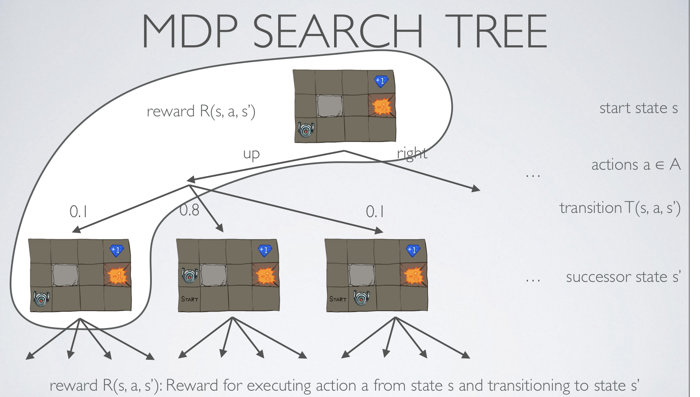
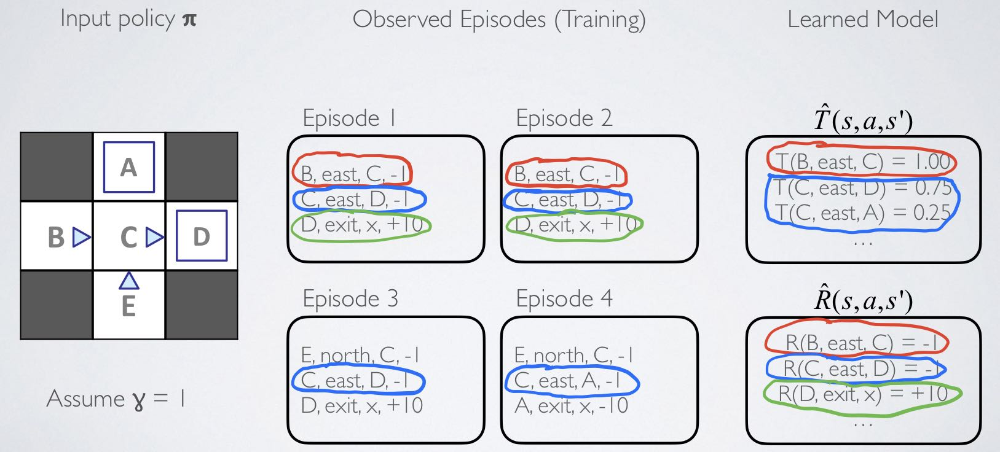
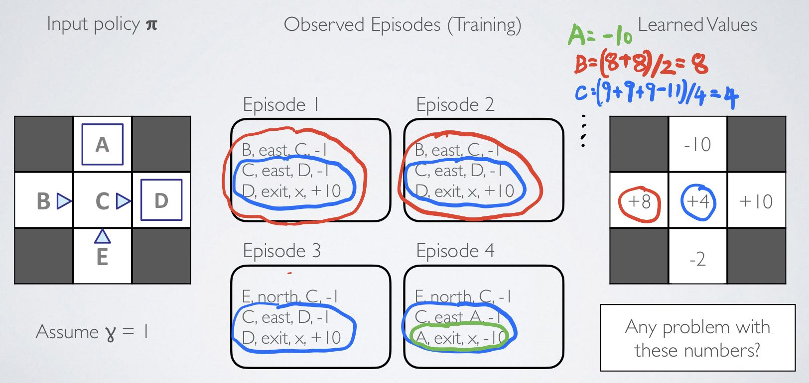

# Introduction to AI
## Markov Models
### Markov Decision Processes (MDP)
- An MDP is defined by
  - A set of states *S*. ie. The coordinates of the robot.
  - A set of actions *A*. ie. Move up / down / left / right
  - A transition function T(s, a, s'): P(s' | s, a), s' means the next state.
  - A reward function R(s, a, s'): Reward of taking action a in s and ending up in s'.
    - Sometimes just R(s, a) / R(s) / R(s')
  - A discount factor $\gamma$: how much we care about next states.
  - A start state and maybe a terminal state.
### MDP Search Tree


- The expected value starting in s, taking action a: $Q^*(s, a) = \sum_{s'}T(s, a, s')[R(s, a, s') + \gamma V^*(s')]$
  - ```python
      def getQValue(self, state, action):
        # transition: a list of (nextState, prob) pairs   T(s, a, s')
        transition = self.mdp.getTransitionStatesAndProbs(state, action)
        # Q*(s, a)
        qValue = 0.0
        for nextState, prob in transition:
            # reward: R(s, a, s')
            reward = self.mdp.getReward(state, action, nextState)
            qValue += prob * (reward + self.discount * self.getValue(nextState))
        return qValue
    ```
- The optimal value of the state s: $V^*(s) = max_aQ^*(s, a)$
- Optimal action to take at state s: $\pi^*(s) = argmax_aQ^*(s, a)$
  - ```python
      def getPolicy(self, state):
        # V*(s) = max_a(Q*(s, a))
        qValueByAction = util.Counter() # use counter.argmax() to get the key with the largest value
        for action in self.mdp.getPossibleActions(state):
            qValueByAction[action] = self.getQValue(state, action)
        # Returns None if there is no key.
        return qValueByAction.argMax()
    ```
## Reinforcement Learning
### Model-based Learning
Learn transition T(s, a, s') and reward R(s, a, s) of the MDP model by counting outcomes s' for each s and a, then use value iteration as we did in the MDP.

### Model-free Learning
Learn and approximate the value function $V^*(s)$ and $Q^*(s, a)$ directly, then extract policy based on approximated values.

> It wastes information about state connections, and each state must be learned separately. So it takes a long time to learn.

#### Q-Learning
Learn Q values based on samples after each action.
$Q(s, a) = Q(s, a) + \alpha*difference$ $(\alpha = learning\ rate)$
$difference = new\ value - old\ value = [reward + \gamma V^*(s')] - Q(s, a)$
$V^*(s') = max_{a'}Q(s', a')$
```python
def update(self, state, action, nextState, reward):
    # Returns self.qValue[(state, action)]
    oldValue = self.getQValue(state, action)
    # getValue(): Returns max_action Q(state,action)
    newValue = reward + self.discount * self.getValue(nextState)
    difference = newValue - oldValue
    # Update Q value
    self.qValue[(state, action)] += self.alpha * difference
```
> Q: When to explore instead of exploit the current policy? (in order to find potential better policies)
A: Random actions -- For every time step. with probability $\epsilon$, act randomly, with probability $1-\epsilon$ , act on the best policy we got.
#### Approximate Q-Learning
> Q-Learning is not scalable. It needs a lot of memory to store all Q-values and takes too long to learn good actions for every state.

Goal: Generalize experiences and knowledge learned to new, simular situations.
Idea: Descirbe a state using a vector of features (important properties like $1 / (distance\ to\ dot)^2 $, distance to closest ghost, ...). Features need to be normalized to [-1, 1] or [0, 1]. (the same idea of machine learning)

$Q(s, a) = w_1f_1(s, a) + w_2f_2(s, a) + ... + w_nf_n(s, a)$. Learn the weights.

*note that there are fewer weights than states, because many states might share the same features, so it is faster to learn.*

Iteration: 
**$w_i = w_i + \alpha*difference*f_i(s, a)$**
$difference = new\ value - old\ value = [reward + \gamma V^*(s')] - Q(s, a)$
$V^*(s') = max_{a'}Q(s', a')$
```python
def getQValue(self, state, action):
    # dot product of matrices
    return self.weights * self.featExtractor.getFeatures(state, action)

def update(self, state, action, nextState, reward):
    difference = (reward + self.discount * self.getValue(nextState)) - self.getQValue(state, action)
    features = self.featExtractor.getFeatures(state, action)
    for feature, value in features.items():
        self.weights[feature] += self.alpha * difference * value
```
## Logic
- Propositional Logic (facts: T/F/UNKNOW)
  -  negation ¬, disjunction ⋁, conjunction ⋀, implication ⇒, equivalence ⇔.
  -  truth table, each row is called a model. Valid/satisfiable/unsatisfiable sentence.
  -  P⇒Q ≣ ¬P V Q, P ⇔ Q ≣ (P⇒Q) ⋀ (Q⇒P)
- Entailment
  - Knowledge Base (KB) ⊨ Sentence (I win)
  - Normal Forms
    - DNF (Disjuctive Normal Forms): Disjunction of conjunctions.
    - CNF (Conjunctive Normal Forms): Conjunction of disjunctions.
      - Horn form: Conjunction of Horn clause (clauses with 0~1 positive literal).
  - Modus Ponens: (P⋁Q) ⋀ (¬Q⋁R) entails (P⋁R)
  - Four ways to check for entailment
    - **Brute-force model checking** in the truth table (not scalable). 
    - **Resolution** (Proof by contradiction)： we include the negation of the query in the KB, and prove that the KB is unsatisfiable by using CNF and Modus Ponens.
    - **Forward chaining**: Use Modus Ponens to infer if a query is true. (Just like Resolution but don't add the negation of the query into the KB).
    - **Backward chaining**: Just like Resolution but uses DPLL/WALKSAT instead of Modus Ponens to check for unsatisfiability.